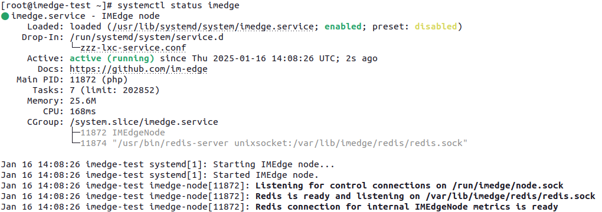

IMEdge - Monitoring on the Edge
===============================

IMEdge ships a bunch of powerful components for your Open Source Monitoring
environment. As in Edge Computing best practices, this brings processing
closer to the data source.

Installation
------------

### Preparation on RHEL/CentOS/Alma/Rocky (8 and 9)

PHP is outdated on RHEL/CentOS/Others v8 and v9, therefore we're going to
install a recent PHP version via REMI. We'll disable the repository by
default

Please note that this is not touching your default PHP installation, if any.
The IMEdge Node package has no hard dependency on a specific PHP version, but
assumes a recent version (>= 8.1) being installed and available.

#### Install REMI repository on RHEL/CentOS/Alma/Rocky 8
```shell
dnf -y install https://rpms.remirepo.net/enterprise/remi-release-8.rpm
```

#### Install REMI repository on RHEL/CentOS/Alma/Rocky 9
```shell
dnf -y install https://rpms.remirepo.net/enterprise/remi-release-9.rpm
```

#### Disable the REMI repository by default
```shell
dnf config-manager --set-disabled remi-modular --set-disabled remi-safe
```

#### Add REMI path to IMEdge node daemons path
```shell
echo PATH="/opt/remi/php83/root/usr/bin:/opt/remi/php83/root/usr/sbin:$PATH" \
  > /etc/default/imedge
```

### Install IMEdge node on RHEL/CentOS/Alma/Rocky (8 and 9)

Now we're ready to install the latest IMEdge node package and a bunch of related
feature packages:

```shell
dnf -y install \
  https://github.com/im-edge/node/releases/download/v0.12.0/imedge-node-0.12.0-1.noarch.rpm \
  https://github.com/im-edge/inventory-feature/releases/download/v0.14.0/imedge-feature-inventory-0.14.0-1.noarch.rpm \
  https://github.com/im-edge/metrics-feature/releases/download/v0.22.0/imedge-feature-metrics-0.22.0-1.noarch.rpm \
  https://github.com/im-edge/snmp-feature/releases/download/v0.13.0/imedge-feature-snmp-0.13.0-1.noarch.rpm \
  https://github.com/im-edge/tcp-feature/releases/download/v0.7.0/imedge-feature-tcp-0.7.0-1.noarch.rpm
```

Your IMEdge Node is now ready to go, and can be started:

```shell
systemctl enable --now imedge
```

You can verify correct operation via `systemctl status imedge.service`:


